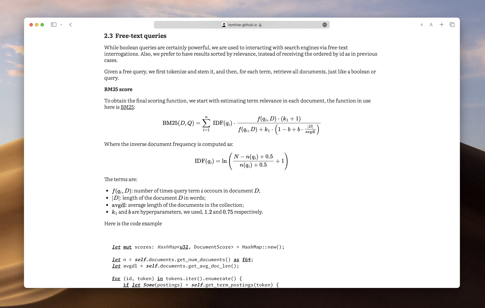

# Typo, a Hugo theme.

**Homepage**


**Article**





## Installation

To receive updates, add the theme as a submodule: 
```
git submodule add git@github.com:tomfran/typo.git themes/typo
```

Otherwise you can clone the repo and copy it manually to yout theme folder.

## Features

### Header autonumbering

You can add auto-numbering to the pages by setting the following parameter in 
the header of your md files. The numbering is currently supported to level 3 subheadings.

```
autonumber: true
```

### Appearance preferences

In your `hugo.toml` file you can specify the preferred theme: 

```
theme = "light | dark | auto"
```

### Dark and light mode images

You can tags to decide if images are displayed in dark or light mode, as Github id doing for readmes.

Let's say you have two different versions
of an image, setting #dark or #light do the trick.

```md


```

You can of course remove the final tag 
to alway show the same image on light and 
dark mode.

## Configuration example

**post.md**

```
---
title: "Search Engine in Rust"
date: "2024-02-01"
summary: "A search engine overview and Rust implementation."
toc: true 
readTime: true
autonumber: true
---

Your content...
```

**hugo.toml**

```toml
baseURL = 'https://example.org/'
languageCode = 'en-us'
title = 'Francesco Tomaselli'
theme = 'Typo'

# Disable tags, actually, they are rendered as a list, but the idea is to disable them.
disableKinds = ['taxonomy']

# Google analytics code
googleAnalytics = "G-xxxxxxxxxx"

[params]
# Math mode
math = true

# Intro on main page, content in markdown, if you omit title or content the other can be displayed
homeIntro = true
homeIntroTitle = 'Hi!'
homeIntroContent = """
I am an Italian Software Engineer with a strong foundation in computer science and a passion for solving complex problems.
I am interested in a range of topics, including algorithms, distributed systems, databases, and information retrieval.
"""

# Collection to display on home page, do not set if tou don't want them
homeCollectionTitle = 'Posts'
homeCollection = 'posts'

# Pagination size across all website, this is the same for homepage and single list page
paginationSize = 100

# Social icons
[[params.social]]
name = "linkedin"
url = "https://www.linkedin.com/in/your-name"

[[params.social]]
name = "medium"
url = "https://medium.com/@your-name"

[[params.social]]
name = "github"
url = "https://github.com/your-name"

# Main menu pages
[[params.menu]]
name = "home"
url = "/"

[[params.menu]]
name = "posts"
url = "/posts"

[[params.menu]]
name = "resume"
url = "/resume"

# Syntax highligth on code blocks, all styles: 
# https://xyproto.github.io/splash/docs/all.html
# I sugges algol
[markup]
[markup.highlight]
style = 'algol'
```
